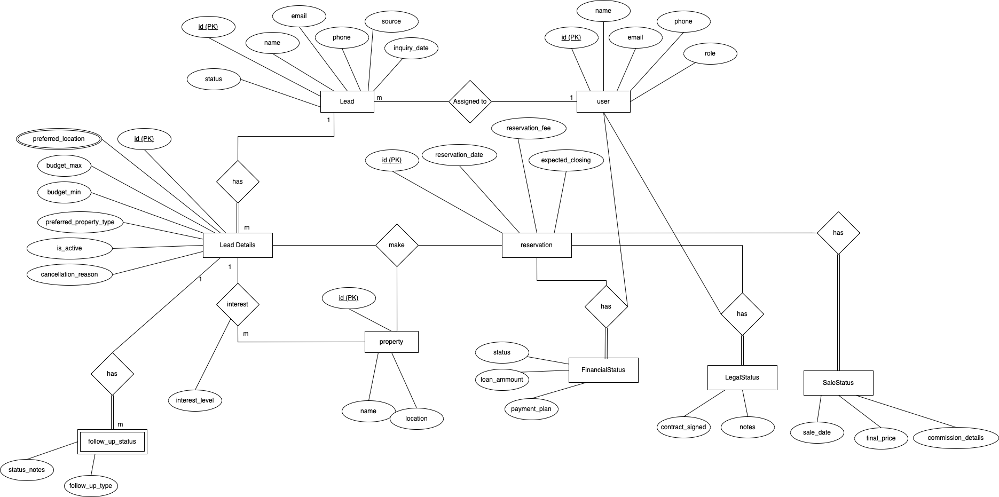

# Home Connect CRM Backend

## Overview

This repository contains the backend for the Home Connect CRM system, which handles the lead lifecycle management for a real estate company. The system tracks leads through various stages, from inquiry to final sale, ensuring data integrity, smooth transitions between stages, and role-based access control for users.

--- 

## 🔐 Role Permissions Setup

There are four distinct roles involved in the system, each responsible for specific phases of the lead lifecycle:

| **Role**       | **Permissions** |
|----------------|-----------------|
| **Admin**      | Assign leads, view all leads, create users, manage system settings |
| **Sales Agent** | View and update assigned leads, create reservations, cancel reservations (only for their own leads) |
| **Finance Team** | Review reservation financials, approve or reject financing |
| **Legal Team** | Finalize legal documents, upload contract notes |

---

## 📄 Role Permissions Table

| **Role**        | **View Leads** | **Assign Leads** | **Create Reservation** | **Approve Finance** | **Finalize Legal** | **Cancel Reservation** |
|-----------------|----------------|------------------|-------------------------|---------------------|--------------------|-------------------------|
| **Admin**       | ✅ All          | ✅                | ❌                      | ❌                  | ❌                 | ❌                      |
| **Sales Agent** | ✅ Own          | ❌                | ✅ (own leads)           | ❌                  | ❌                 | ✅ (own leads)           |
| **Finance Team**| ✅ All          | ❌                | ❌                      | ✅                  | ❌                 | ❌                      |
| **Legal Team**  | ✅ All          | ❌                | ❌                      | ❌                  | ✅                 | ❌                      |

---

### 📌 Notes:

- **Admin** has full system control but does **not** interfere in Finance or Legal stages.
- **Sales Agents** operate mainly during the early and middle stages of the lead lifecycle.
- **Finance** and **Legal** teams are involved after a reservation is created.
- **Cancel Reservation** is allowed **only** during the Reservation stage, and **only** by the **Sales Agent** who owns the lead.


## Assumptions & Clarifications

### A-01: Preferred Property Type – Capture Timing

**Clarification:** While the business requirements suggest it's captured during Stage 1 (Unassigned), the data model places it in Stage 2 (Assigned).

- **Assumption:** The system captures the preferred property type during initial inquiry (Stage 1). Sales agents can update/refine it during follow-up (Stage 2).

### A-02: Reservation Rejected – Data Handling

**Clarification:** It's unclear what happens to reservation data when a lead’s financial approval is rejected.

- **Assumption:** Reservation data is not deleted. It is marked as reverted or rejected using a status field, and a reason is stored (e.g., "Financial rejection"). This ensures auditability, historical tracking, and seamless future re-engagement.

### A-03: Roles & Permissions

**Clarification:** The documentation refers to Admin, Sales Agent, Finance, and Legal but doesn’t clearly separate all of them in the role matrix.

- **Assumption:**
  - Admin has full control over assignments, approvals, and cancellations.
  - Sales Agent handles lead follow-ups and reservations.
  - Finance team reviews financial data.
  - Legal team handles contract validation.
    These roles are distinct in terms of workflow responsibility, even if some permissions overlap in the UI.

### A-04: Authentication & User Sessions

**Clarification:** Authentication or session handling is not described.

- **Assumption:** User authentication is managed externally (e.g., login/auth microservice). This module assumes users are already authenticated and authorized via role-based access control (RBAC). This module only expects an authenticated user's ID to be available via the request headers (e.g., x-user-id). The user's role (Admin, Sales Agent, etc.) is validated internally by querying the database during RBAC checks.

### A-05: Duplicate Lead Detection

**Clarification:** The CRM workflow doesn’t mention deduplication logic.

- **Assumption:** Duplicate lead detection (based on phone/email) is not enforced automatically and must be handled manually by admins or through separate analytics processes.

### A-06: Timezones & Date Handling

**Clarification:** No guidance is given on how to store or display dates.

- **Assumption:** All date fields (e.g., inquiry date, reservation date) are stored in UTC, and any timezone conversion happens at the frontend/UI layer.

### A-07: Property Data Validity

**Clarification:** The system references properties by ID, but no property schema or validation rules are provided.

- **Assumption:** Property data (ID, location, price) is sourced from a separate property inventory system and assumed to be valid at the time of reservation.

### A-08: Lead Cancellations Are Irreversible

**Clarification:** The business rule says leads can be cancelled only during the reservation stage, but not whether they can be "reopened."

- **Assumption:** Once a lead is marked as cancelled, it cannot be reverted. It must be duplicated or re-entered to reinitiate the sales process.

### A-09: Final Sale – Sales Agent Marks Lead as Sold

**Clarification:** The documentation outlines that the legal team finalizes the contract in the Reservation (Legal Finalized) stage. However, it does not specify who moves the lead to the final “Sold” stage.

- **Assumption:** After legal finalization, the Sales Agent who owns the lead is allowed to mark it as “Sold.” They are responsible for entering:
  - Final sale price
  - Commission details
  - Sale date

### A-10: Loan-Based Property Purchase and Financial Approval

**Clarification:** The documentation doesn't specify whether properties can be bought without a loan, nor does it indicate how the loan approval status is tracked.

- **Assumption:** All properties will be bought via a loan. The loan approval status will be included as part of the financial status, indicating whether the loan is approved or rejected. This status will determine whether the lead progresses through the financial stage of the lifecycle.

---

## Future Implementation & Suggestions

- **Admin Tracking:** It is recommended to track the admin who assigned a lead to a sales agent. This would help maintain accountability and improve the traceability of decisions in the CRM system.

  **Suggestion:** Consider adding an `assigned_by` field to the lead record, which stores the `Admin ID` who made the assignment. This would provide better auditability and transparency in lead management.

---

## Setup Instructions

### Prerequisites:

- Node.js (v14 or higher)
- MySQL (or PostgreSQL)
- Sequelize ORM

### Installation:

1. Clone the repository:
   ```bash
   git clone https://github.com/radika-insfra/home-connect-crm-backend.git
   cd home-connect-crm-backend
   ```

2 Install dependencies:

    npm install

3. Set up the environment variables:

Copy the env.example file to .env and configure the required values (e.g., database credentials).

4. Import the database schema:

Run the tables.sql file to create the necessary database tables:

```
mysql -u username -p database_name < tables.sql
```

5. Start the application:

` npm start`

---

## 📋 Test Data Insertion

To insert sample test data into the database, run the following command:

```bash
node src/scripts/seedTestData.js
```

---

## Database Schema

The `tables.sql` file contains the database schema, which defines the tables, relationships, and constraints for the lead lifecycle management module. You can view and use the schema by opening the file:

[View `tables.sql`](./docs/tables.sql)

---

## Entity Relationship Diagram (ERD)

Below is the Entity Relationship Diagram (ERD) for the lead lifecycle management module.



### Assumptions in the ERD

- **Single Lead Can Have Multiple Details**: A lead can have multiple details because if a lead cancels a reservation, it reverts back to the assigned state, creating new details for the same lead.
- **Property Interest**: The property interest is related to the lead details and is **not a weak entity**. It is treated as a normal entity in the context of the lead.

- **FinancialStatus, LegalStatus, and SaleStatus**: These are also **not weak entities**. They are treated the same as lead details and are integral to the lead's lifecycle stages.

---

## API Documentation

The API documentation is available via Swagger UI. To view the documentation:

1. Ensure the server is running.
2. Open your browser and navigate to `http://localhost:3000/api-docs` (or replace `localhost:3000` with your actual server URL).

This will show the interactive Swagger UI, where you can explore all available endpoints, their parameters, and responses.

---

## Example Request:

Once the server is running, you can visit the following URL to view the Swagger documentation:

[API Documentation](http://localhost:3000/api-docs)
